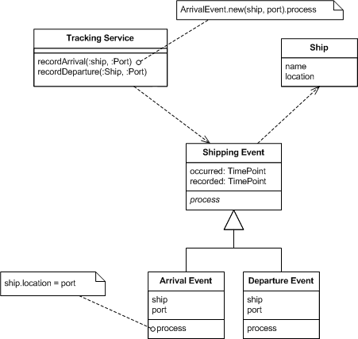
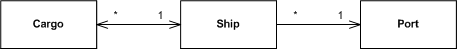
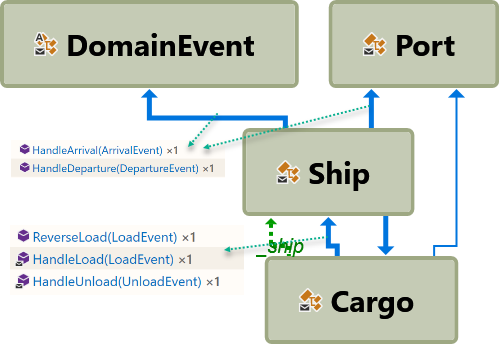
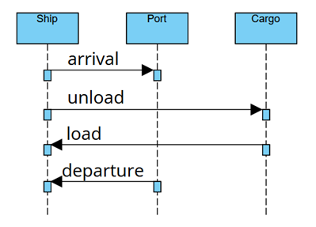
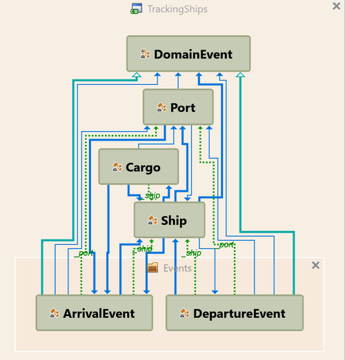
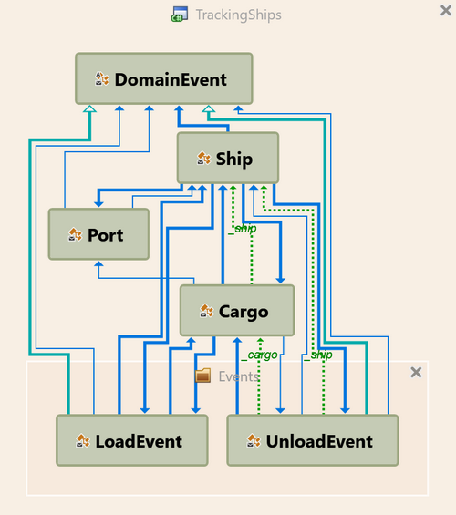
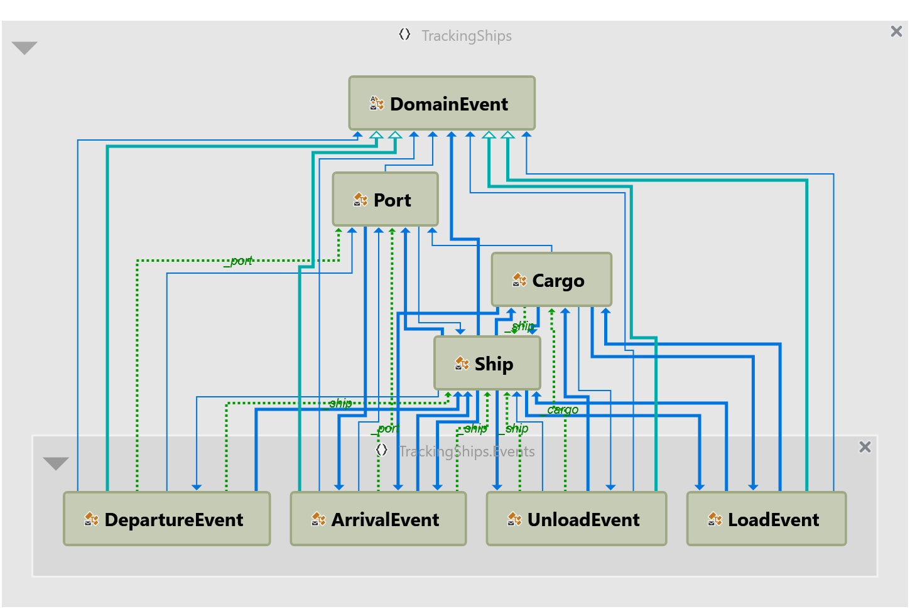

# Working example Event Sourcing
## Introduction
Into Martin Fowler [blog post](https://martinfowler.com/eaaDev/EventSourcing.html) you can find some code pieces illustrated [Event Sourcing pattern](https://learn.microsoft.com/en-us/azure/architecture/patterns/event-sourcing).
As I can not find the complete working example, I decided to create it myself.
Some parts of the code was missing and some parts I refactoring a little bit.
In any case it an example, don't try to use it into production.

## Base principle
As usual we could use a simple classes for tracking ship movements

  
*Figure 1: A simple interface for tracking shipping movements.* © Martin Fowler

- **pro**: easy implementation.  
- **contra** stored final state only, hard to replay all actions again

  
*Figure 2: Using an event to capture the change.* © Martin Fowler

- **pro**: easy to replay all actions again in case of error correction as all actions are stored.
Changes to the domain object could be made only over events.
- **contra** not so easy implmentation and understanding.

Lets imagine that we have an error in production system then we could replay all stored events into deployemnt and debug it.  

For example a simple model is using - ships that carry cargo and move between ports.
  
*Figure 3: The domain model* © Martin Fowler

## Type Dependencies
When we try to analyze the code then we can see a little bit complicated dependency as ship must handle domain enents.

  
*Figure 4: Type dependency for the domain model*

  
*Figure 5: Sequence diagramm for the domain model*

  
*Figure 6: Type dependency for the arrival/departure events*

  
*Figure 7: Type dependency for the load/unload events*

  
*Figure 8: Type dependency for the all implemented events*

## How to run example

First read the Marting Fowler blog, then start the example.
Clone the code, open solution, run console application. You can see the follwing output:
```
Martin Fowler event sourcing example:
ship 'King Roy' has arrived at the port of Vancouver (CA), date 02.11.2005, cargo 0 units
loaded cargo 'Refactoring'
ship 'King Roy' departed from port Vancouver (CA), date 03.11.2005, cargo 1 units
ship 'Prince Trevor' has arrived at the port of Los Angeles (US), date 04.11.2005, cargo 0 units
ship 'King Roy' has arrived at the port of San Francisco (US), date 04.11.2005, cargo 1 units
unloaded cargo 'Refactoring'
loaded cargo 'Clean Code'
ship 'King Roy' departed from port San Francisco (US), date 07.11.2005, cargo 1 units
ship 'King Roy' has arrived at the port of Vancouver (CA), date 01.12.2005, cargo 1 units
cargo 'Clean Code' has been in Canada
```